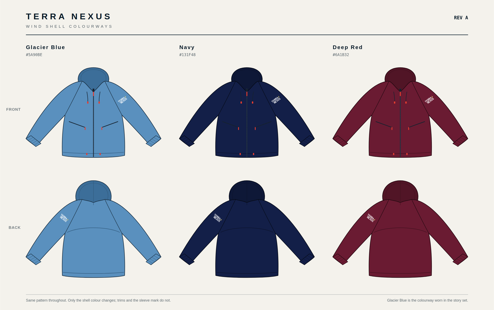

# Terra Nexus wind shell — Rev A

The blue jacket worn throughout the story set, worked up as a product: a
lightweight hooded wind shell with raglan sleeves, drawn to real garment
measurements so it can be quoted, graded and rendered consistently.



---

## Files

Every SVG has a matching PNG export at 2000 px (2400 px for the sheets).

| File | What it is |
| --- | --- |
| `jacket-flat-front.svg` / `-back.svg` | Technical flats, Glacier Blue. 1 user unit = 1 mm at garment scale, size M. |
| `jacket-flat-front-navy.svg`, `-red.svg` (and backs) | The same pattern on the other two shells. |
| `jacket-spec-sheet.svg` | Dimensioned sheet — callouts, measurements, size run, fabric, trims, branding. |
| `jacket-colourways.svg` | All three colourways, front and back. |
| `build/` | The scripts that generate everything. `sh build/make.sh` rebuilds the lot. |

---

## The garment

A single-layer wind shell — not a hardshell, not insulated. What the story set
shows, and what this specifies:

- **Attached hood**, three panel, elastic-bound face opening, rear volume cord
- **Raglan sleeves**, single-needle topstitched
- **Full-length centre-front zip**, chin guard and zip garage
- **Two zipped hand pockets**, welted, mesh bags
- **Elasticated cuffs**, 20 mm knitted
- **Hem drawcord** with moulded toggles at the front hem
- **Sleeve mark** on the wearer's left upper arm

### Measurements — size M

| | |
| --- | --- |
| Centre back length | 68.4 cm |
| Chest, laid flat | 53.6 cm |
| Hem, laid flat | 54.4 cm |
| Sleeve, CB neck to cuff | 77.3 cm |
| Cuff opening, relaxed | 11.2 cm |
| Front neck drop | 9.2 cm |
| Underarm drop from HPS | 30.0 cm |

Size run XS–XXL. Chest grades +2.0 cm to L then +2.5 cm, length +2.0 cm,
sleeve +1.5 cm.

### Fabric and trims

- Shell: 40D ripstop nylon, plain weave, 68 g/m², PU coating, C0 DWR,
  5,000 mm water column. Single layer, unlined. 285 g in size M.
- Front zip YKK #5 reverse coil with an auto-lock slider; pocket zips YKK #3.
- Pulls moulded in Terra Nexus Red `#E63D2F`; 3 mm flat black cord with red
  toggles; 20 mm knitted cuff elastic.
- Woven main label at centre back neck, care label at the left side seam.

---

## Colour

**Glacier Blue `#5A90BE`** is not a guess. Every frame in the story set is shot
at golden hour, so the jacket photographs far warmer than it is. The value was
recovered by taking grey scree in the same frames as a neutral reference,
solving for the illuminant, and fitting one garment colour across four scenes
with a per-scene exposure term. Three independent scenes landed within a couple
of points of each other.

| Colourway | Shell | Note |
| --- | --- | --- |
| **Glacier Blue** | `#5A90BE` | primary — the colourway worn in the story set |
| **Terra Nexus Navy** | `#131F48` | alternate |
| **Terra Nexus Deep Red** | `#6A1B32` | alternate, pairs with the Deep Red patch |

Trims and the sleeve mark do not change with the shell.

---

## The branding decision

The sleeve mark is a **heat-transfer print**, 84 mm wide, white wordmark with
the sand star — **not a sewn patch**.

The story set currently shows a sewn patch on the jacket's upper arm in seven
scenes, but the package rule is explicit: patches go on bags only, nowhere else.
A printed mark keeps the brand on the sleeve without breaking that rule, and on
a 68 g/m² shell it is the right construction anyway — a stitched patch perforates
the coating and adds a hard point to a garment that is meant to pack down.

If that rule changes, the patch artwork in `../Patch` drops straight in at the
same 84 mm width.

---

## What is observed and what is specified

The story set only ever shows the jacket **from behind**. The hood, raglan
seams, back yoke, cuffs, hem, silhouette and sleeve mark placement are all read
from those frames.

The **front is specified, not observed** — zip, chin guard, pockets, hem toggles.
It is drawn as a conventional wind shell front consistent with the back. If you
have a front reference, send it and the flat gets corrected rather than guessed.

## Rebuilding

```sh
sh Branding/Jacket/build/make.sh
```

Needs Python with Pillow and NumPy, plus a Chromium binary for the PNG step
(`CHROME=/path/to/chrome` if it is not on `PATH`). The sleeve mark is drawn from
the same traced lockup the patch is built from, `../Patch/build/glyphs.json`, so
the two products cannot drift apart.
