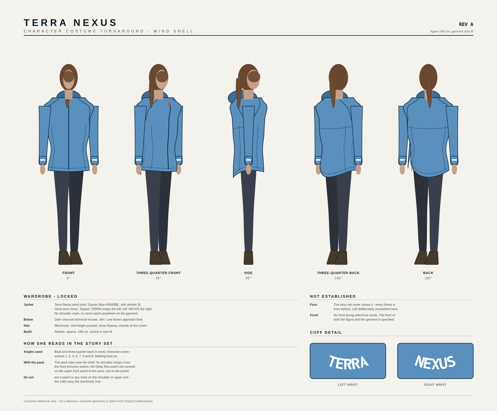

# Main character — costume reference, Rev A

How the main character should look in the new wind shell, at five angles.



> **Read this first.** These are *costume* references, not a likeness. I have no
> image generator in this environment, so I could not produce photoreal renders.
> What is here instead: a turnaround built from the real garment geometry, a
> locked wardrobe description, and a prompt kit so whoever does have a generator
> gets the same character every time.

---

## Files

| File | What it is |
| --- | --- |
| `character-turnaround.svg` / `.png` | All five angles on one sheet, with the wardrobe locked and the open questions flagged. |
| `character-front.svg`, `-three-quarter-front`, `-side`, `-three-quarter-back`, `-back` | Each angle on its own, sized to drop straight into an image model as a reference. |
| `build/` | The scripts. `sh build/make.sh` rebuilds everything. |

---

## How the turnaround is built

The figure is one model, not five drawings. Each horizontal slice of the body is
an ellipse with a half-width and a half-depth; rotating that model about the
vertical axis and projecting gives both the silhouette and the position of every
seam. So the views cannot disagree with each other — the centre-front zip
travels off the edge, the back yoke comes into view, the ponytail swings round,
all from the same numbers.

Garment widths come straight from `../Jacket`, converted from laid-flat to worn.
That conversion matters: a laid-flat half-width of 240 mm is a tube of 960 mm
circumference, which on a body is an ellipse about 174 mm across — not 240. Using
the flat width directly turns a slim shell into a parka, which is exactly what
the first pass looked like.

---

## Wardrobe — locked

| | |
| --- | --- |
| **Jacket** | Terra Nexus wind shell, Glacier Blue `#5A90BE`, slim athletic fit. Hood worn down and bunched behind the neck. Front zip closed. |
| **Cuffs** | **TERRA** wraps the left wrist, **NEXUS** the right. White block capitals. |
| **Nowhere else** | No shoulder mark, no chest logo, no sewn patch anywhere on the garment. |
| **Below** | Slim dark charcoal technical trouser. Low brown approach boot. |
| **Hair** | Mid-brown, mid-height ponytail, loose flyaway strands at the crown. |
| **Build** | Athletic, approximately 168 cm. Jacket is size M. |

## Not established — your call, not mine

- **Her face.** The story set never shows it. Every character frame is shot from
  behind or over the shoulder. The turnaround leaves the face deliberately
  unresolved rather than inventing one that then gets locked in by repetition.
  Pick a face, generate one reference portrait, and add it here.
- **The front of her.** No front-facing frame exists, so the front of both the
  figure and the garment is specified rather than observed.
- **She is not Laura.** The character in the story set has mid-brown hair in a
  ponytail; the Laura references in `People/` are a different person. If the
  character is meant to be a real person, say so and this all gets redrawn.

---

## Prompt kit

Paste the base block, then one angle line. Attach the matching
`character-<angle>.png` and `../Jacket/jacket-flat-front.png` as references.

**Base — use verbatim every time:**

```
A woman in her early thirties, athletic build, about 168 cm, mid-brown hair
pulled into a mid-height ponytail with loose flyaway strands at the crown. She
wears a slim-fitting single-layer hooded wind shell in glacier blue, hood worn
down and bunched behind the neck, front zip closed. Raglan sleeves, princess
seams front and back giving a nipped waist, long shaped cuffs with thumbholes,
hem falling to the hip and scooped slightly lower at centre back. Block capitals
wrap the cuffs: TERRA around the left wrist, NEXUS around the right, printed in
white. No logo, patch or mark on the shoulder, upper arm or chest. Slim dark
charcoal technical trousers, low brown approach boots. Golden hour alpine light,
photographic, 50 mm.
```

**Angle lines:**

| Angle | Add |
| --- | --- |
| Front | `Seen from the front, standing square to camera.` |
| Three-quarter front | `Turned about 40 degrees from camera, three-quarter front view.` |
| Side | `Full profile, side on.` |
| Three-quarter back | `Turned about 140 degrees, seen mostly from behind, looking away over her shoulder.` |
| Back | `Seen directly from behind.` |

**Keep out:** shoulder patch, chest logo, mountain graphic above the wordmark,
boxy or oversized fit, elasticated gathered cuffs, hood worn up.

**With the pack:** the pack rides over the shell. Its shoulder straps cross the
front princess seams, and the Deep Red patch sits centred on the upper front
panel of the pack — never on the jacket. See `../Patch`.

---

## Rebuilding

```sh
sh "Output Drafts/Character/build/make.sh"
```

Needs Python plus a Chromium binary for the PNG step. The garment geometry is
imported live from `../Jacket/build/build_jacket.py` and the cuff letterforms
from `../Patch/build/glyphs.json`, so the character sheet cannot drift away from
the product specs.
