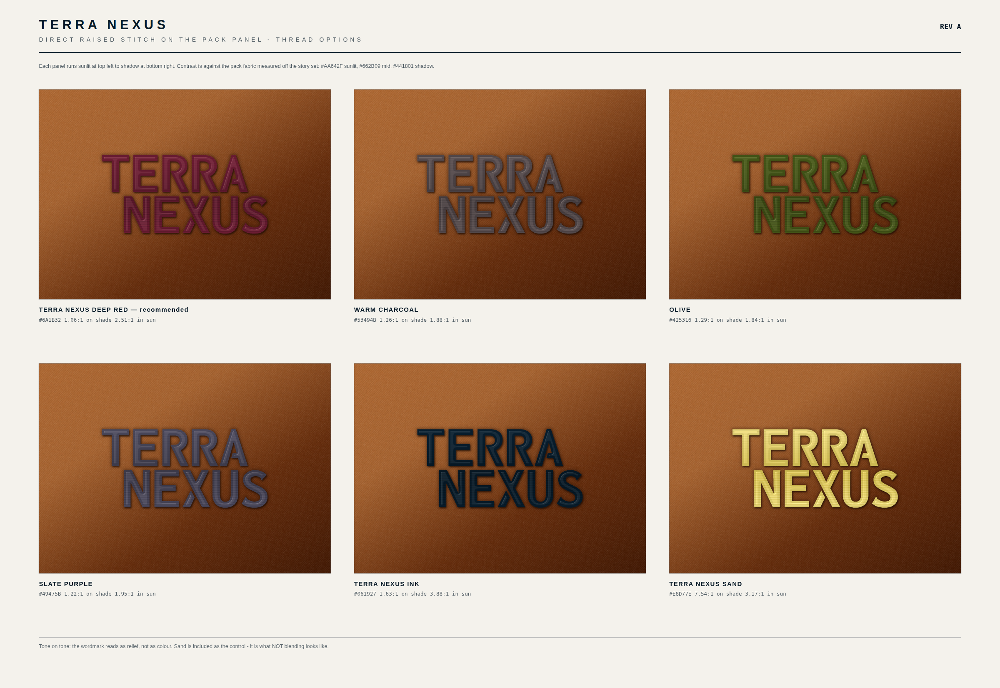

# Direct raised stitch — pack panel, Rev A

The wordmark stitched **straight onto the bag**, no patch ground, in a thread
close enough to the fabric that it reads as texture rather than as a label.



---

## What this is, and when to use it

The patch in `../Patch` is a statement — a dark rectangle that announces itself.
This is the opposite: block letters raised off the panel in a tone-on-tone
thread. From two metres it is a shadow in the fabric. Up close it is
unmistakable. **You read the relief, not the colour.**

It replaces the patch on the panel. Do not run both.

---

## Files

| File | What it is |
| --- | --- |
| `stitch-flat.svg` | Production artwork. 1 user unit = 1 mm, at true size, letters only. This is what the digitiser gets. |
| `stitch-spec-sheet.svg` | Dimensions, thread ranking, foam construction. |
| `stitch-colourways.svg` | Six threads on pack fabric, each panel running sunlit to shadow. |
| `stitch-<thread>.svg` | One thread on fabric. |
| `stitch-<thread>-alpha.svg` | The stitching alone on transparent, for compositing onto photography. |
| `stitch-on-bag-<thread>.png` | Before / after on the real pack in scene 6, at true scale. |
| `build/` | `sh build/make.sh` rebuilds everything. |

---

## Size

| | |
| --- | --- |
| Finished width | **85 mm** |
| Height | 40.3 mm |
| Cap height | 18.89 mm |
| Stem | 3.63 mm |
| Narrowest bar | 3.10 mm |

The narrowest stroke matters here: 3 mm foam-backed satin holds a clean edge,
2 mm is the floor, and below that foam blows out. At 85 mm this design has
margin. Do not scale it below **60 mm** finished width.

## Thread — ranked by how quietly it sits

Contrast measured against the pack fabric sampled from the story set:
`#AA642F` sunlit, `#662B09` mid, `#441801` shadow.

| Thread | Hex | On shade | In sun | |
| --- | --- | --- | --- | --- |
| **Terra Nexus Deep Red** | `#6A1B32` | 1.06 : 1 | 2.51 : 1 | **recommended** |
| Warm Charcoal | `#53494B` | 1.26 : 1 | 1.88 : 1 | most consistent |
| Olive | `#425316` | 1.29 : 1 | 1.84 : 1 | quietest overall |
| Slate Purple | `#49475B` | 1.22 : 1 | 1.95 : 1 | cooler cast |
| Terra Nexus Ink | `#061927` | 1.63 : 1 | 3.88 : 1 | reads dark in sun |
| Terra Nexus Sand | `#E8D77E` | 7.54 : 1 | 3.17 : 1 | the control — what *not* blending looks like |

**Deep Red** is the pick: at 1.06 : 1 against the fabric's mid-tone it is
essentially invisible as colour, it is warm so it never looks like a stain, and
it ties to the Deep Red patch colourway already running on the set.

**Olive and Warm Charcoal are technically quieter** — their contrast barely moves
between shade and full sun, where Deep Red climbs to 2.51 : 1. If you want it to
disappear in every light rather than mostly disappear, take Olive.

## Construction

- **3D foam satin.** 2 mm foam laid under the columns, stitched through, torn
  away. This is what makes it raised — flat satin at this contrast would vanish.
- Satin columns running across each stroke. Centre-run plus edge-walk underlay,
  0.25 mm inset. 0.38 mm pitch.
- Cut-away backing, 50 g, behind the panel before assembly.
- Centred on the upper front panel, top of the wordmark 40 mm below the lid seam.

## Why letters only

The compass star cannot be foamed. Its minor rays taper below 1 mm and foam needs
2 mm to hold an edge — it would come out as a blob. If the star has to appear,
run it as flat satin beside the foamed letters, never through them.

## Rebuilding

```sh
sh "Output Drafts/Direct-Stitch/build/make.sh"
```
