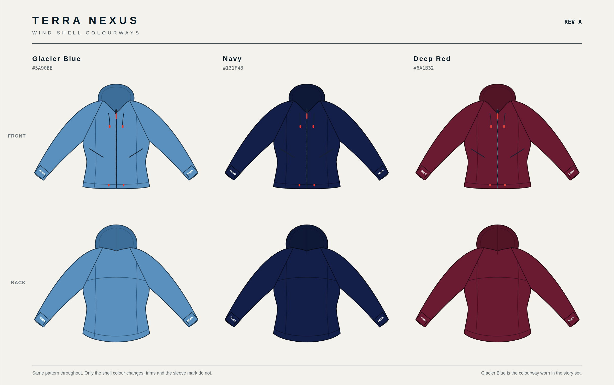

# Terra Nexus wind shell — Rev B

The blue jacket worn throughout the story set, worked up as a product: a
lightweight hooded wind shell cut to a **slim athletic fit**, drawn to real
garment measurements so it can be quoted, graded and rendered consistently.



---

## Files

Every SVG has a matching PNG export at 2000 px (2400 px for the sheets).

| File | What it is |
| --- | --- |
| `jacket-flat-front.svg` / `-back.svg` | Technical flats, Glacier Blue. 1 user unit = 1 mm at garment scale, size M. |
| `jacket-flat-front-navy.svg`, `-red.svg` (and backs) | The same pattern on the other two shells. |
| `jacket-spec-sheet.svg` | Dimensioned sheet — callouts, measurements, size run, fabric, trims, branding. |
| `jacket-colourways.svg` | All three colourways, front and back. |
| `build/` | The scripts that generate everything. `sh build/make.sh` rebuilds the lot. |

---

## Fit

Slim athletic. The shaping is carried by three things working together, not by
simply cutting a smaller box:

- **Princess seams** front and back, running from the raglan seam through the
  waist to the hem. These are what let the garment follow the body instead of
  hanging off the shoulders.
- **Shaped side seams** — the waist comes in **6.4 cm** off the chest, then
  releases again to the hem so the jacket does not pull when it is zipped.
- **Slim tapered sleeves** into a long 66 mm cuff, 8.4 cm relaxed opening.

The hem is **scooped at centre back**, 4.6 cm below the side hem, so the back
stays covered when the wearer bends forward over a pack strap or a map.

### Measurements — size M

| | |
| --- | --- |
| Fit | slim athletic |
| Centre back length | 66.8 cm |
| Centre front length | 62.2 cm |
| Chest, laid flat | 48.0 cm |
| Waist, laid flat | 41.6 cm |
| Hem, laid flat | 47.2 cm |
| Sleeve, CB neck to cuff | 76.7 cm |
| Cuff opening, relaxed | 8.4 cm |
| Underarm drop from HPS | 28.5 cm |

Size run XS–XXL. Chest grades +2.0 cm to L then +2.5 cm, length +2.0 cm,
sleeve +1.5 cm.

### Fabric and trims

- Shell: 40D ripstop nylon, plain weave, 68 g/m², PU coating, C0 DWR,
  5,000 mm water column. Single layer, unlined. 285 g in size M.
- Front zip YKK #5 reverse coil with an auto-lock slider; pocket zips YKK #3.
- Pulls moulded in Terra Nexus Red `#E63D2F`; 3 mm flat black cord with red
  toggles.
- Cuff: 66 mm bonded, thumbhole, no elastic — the cuff is shaped, so it stays
  flat under the wordmark.
- Woven main label at centre back neck, care label at the left side seam.

---

## Colour

**Glacier Blue `#5A90BE`** is not a guess. Every frame in the story set is shot
at golden hour, so the jacket photographs far warmer than it is. The value was
recovered by taking grey scree in the same frames as a neutral reference,
solving for the illuminant, and fitting one garment colour across four scenes
with a per-scene exposure term. Three independent scenes landed within a couple
of points of each other.

| Colourway | Shell | Note |
| --- | --- | --- |
| **Glacier Blue** | `#5A90BE` | primary — the colourway worn in the story set |
| **Terra Nexus Navy** | `#131F48` | alternate |
| **Terra Nexus Deep Red** | `#6A1B32` | alternate, pairs with the Deep Red patch |

Trims and the cuff wordmarks do not change with the shell.

---

## Branding

The wordmark is **split across the two cuffs**:

- **TERRA** wraps the **left** wrist closure
- **NEXUS** wraps the **right** wrist closure

Both are heat-transfer prints in white, 12.5 mm caps, set on a shallow arc so
they read as wrapping the wrist rather than sitting flat on it. The letterforms
are the traced Terra Nexus block capitals, the same ones the patch is built from
— not a substitute font.

**There is no shoulder mark and no sewn patch anywhere on this garment.** The
old sleeve lockup is gone. Sewn patches are bags only in this package.

One call worth flagging: the approved lockup carries the compass star, and a
wordmark split across two wrists leaves the star with nowhere to live. Both
cuffs are letters only. If you want the star, the natural home is after NEXUS on
the right cuff — say the word and it goes in.

---

## What is observed and what is specified

The story set only ever shows the jacket **from behind**. The hood, raglan
seams, back yoke, silhouette and colour are read from those frames.

The **front is specified, not observed** — zip, chin guard, pockets, hem
toggles. It is drawn as a conventional wind shell front consistent with the
back. If you have a front reference, send it and the flat gets corrected rather
than guessed.

The **slim fit and the cuff branding are directed, not observed** — they come
from your brief and the fit references you supplied, not from the story frames.
The scenes still show the older, looser jacket with a shoulder patch; they would
need re-rendering to match this spec.

## Rebuilding

```sh
sh "Output Drafts/Jacket/build/make.sh"
```

Needs Python with Pillow and NumPy, plus a Chromium binary for the PNG step
(`CHROME=/path/to/chrome` if it is not on `PATH`). The cuff wordmarks are drawn
from the same traced letterforms the patch is built from,
`../Patch/build/glyphs.json`, so the two products cannot drift apart.
