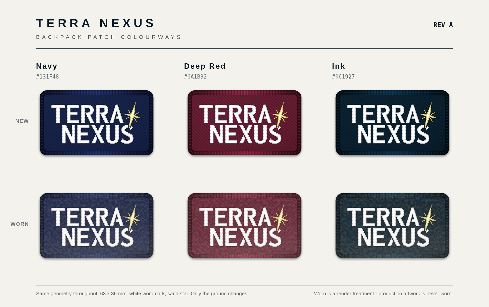
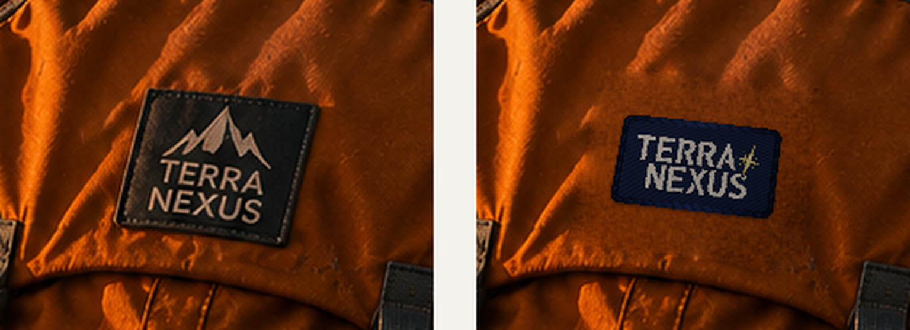

# Terra Nexus embroidered backpack patch — Rev A

The single sewn patch that goes on the pack in every scene of the story set:
the **approved stacked lockup — TERRA over NEXUS with the star** — drawn to a
real finished size so it can be quoted, stitched, and rendered consistently.

It comes in **three colourways** sharing one geometry, each available new or
lightly worn.



---

## Files

Every SVG has a matching PNG export at 2000 px (2400 px for the sheets).

| File | What it is |
| --- | --- |
| `patch-flat.svg` | Production artwork, navy. 1 user unit = 1 mm, so the file opens at true size. Send this to the mill. |
| `patch-flat-red.svg`, `patch-flat-ink.svg` | The same artwork on the other two grounds. |
| `patch-embroidered.svg` | Rendering treatment — twill ground, satin stitching, merrowed edge. Visual reference for image work, **not** for production. |
| `patch-embroidered-red.svg`, `-ink.svg` | The other two colourways, same treatment. |
| `patch-embroidered-worn.svg`, `-red-worn.svg`, `-ink-worn.svg` | Lightly worn renders — faded thread, trail dust, fibre bloom. Rendering only. |
| `patch-colourways.svg` | All six side by side, with hex values. |
| `patch-colourways-on-bag.png` | All six composited onto the pack in scene 6 at true scale — the sheet to choose from. |
| `patch-spec-sheet.svg` | Dimensioned technical drawing with thread colours and construction notes. |
| `patch-placement-reference.png` | Scene 6 before / after: the non-conforming patch removed, the approved patch laid back at true physical scale. |
| `lockup-stacked.svg` | The approved stacked lockup on its own, normalised to cap height 100. Useful well beyond the patch. |
| `build/` | The scripts that generate everything above. See [Rebuilding](#rebuilding). |

---

## The design

|  |  |
| --- | --- |
| Finished size | **63 × 36 mm** (2.48 × 1.42 in) |
| Corner radius | 4 mm |
| Edge | Merrowed overlock, 2.5 mm wide, navy |
| Artwork width | 50 mm, centred — 6.5 mm clear to the finished edge on all four sides |
| Cap height | 10.10 mm |
| Aspect | 1.75 : 1 |

### Colours

Three threads, no more. Two of them never change:

| Name | Hex | RGB | Used for |
| --- | --- | --- | --- |
| White | `#FFFFFF` | 255 · 255 · 255 | wordmark |
| Terra Nexus Sand | `#E8D77E` | 232 · 215 · 126 | star |

The white-wordmark / sand-star pairing is the brand's own two-colour
relationship from `Trasnparent-StdLogo.png`. Only the ground moves:

| Colourway | Ground | RGB | Reads as |
| --- | --- | --- | --- |
| **Navy** | `#131F48` | 19 · 31 · 72 | the approved default — clear separation from the pack, still soft |
| **Deep Red** | `#6A1B32` | 106 · 27 · 50 | warmest of the three; closest in hue to the burnt-orange pack, so it harmonises but separates least at distance |
| **Ink** | `#061927` | 6 · 25 · 39 | highest contrast, sharpest read; close to black at patch size |

`patch-colourways-on-bag.png` shows all three on the actual pack — worth looking
at before choosing, because they behave differently against orange than they do
on a swatch.

The brand pack defines colour in hex only — there is no Pantone system to
reference. Match these RGB values off the mill's physical thread card and get a
strike-off approved before bulk.

### Worn

Each colourway also renders lightly worn: the thread fades and warms a little,
trail dust settles into the stitch valleys and along the bottom edge, and the
raised satin picks up fibre bloom where it has rubbed. The geometry is
untouched.

Worn is a **rendering treatment only**. The production artwork
(`patch-flat*.svg`) is never worn — a mill stitches the clean file, and wear is
something the pack does over time.

### Construction

- Embroidered patch, 100 % stitch coverage
- Navy twill backing, iron-on adhesive plus sew-through
- Wordmark and star: satin columns. Ground: tatami fill at 45°
- 0.40 mm satin pitch, 0.20 mm underlay
- The star is knocked out of the wordmark with a **0.45 mm** gap — this is both
  faithful to the approved lockup and the colour break the stitching needs
- Tolerance ± 1.0 mm on the finished size

---

## One thing to decide before you order

At 63 mm the letters are comfortable — 1.94 mm stems, 1.66 mm bars, both well
clear of the 1.2 mm satin minimum. **The star's minor rays are not.** They taper
to about **0.60 mm**, below the ~0.9 mm a satin column can hold, so the ray tips
will round off and read heavier than drawn.

Three ways out, in the order I'd rank them:

1. **Run it woven instead of embroidered.** A woven label resolves detail down
   to ~0.3 mm and reproduces the star exactly. It also gives a flatter, more
   technical look that suits the pack. The artwork needs no change.
2. **Keep it embroidered and digitise the rays as tapered satin with a 0.9 mm
   floor.** Accept slight tip rounding. `build/trace_star_stitch.py` generates a
   pre-thickened star (`STAR_STITCH` in `build/glyphs.json`) for the digitiser.
3. **Go bigger.** The rays clear 0.9 mm at about 86 mm wide, which is a large
   patch for this panel.

Scenes render the same either way — the difference only shows in the hand.

---

## Where it goes

- **One patch design, everywhere.** Same artwork, same construction, in every
  scene — and **one colourway**. Pick a ground and hold it across the set;
  mixing them breaks the rule the story pack is built on.
- **New or worn, pick one too.** A worn patch in some scenes and a fresh one in
  others reads as a continuity error. The exception is if you want it to carry
  meaning — a fresh patch in the opening scene and a worn one at the summit is a
  deliberate device, not an accident, and it needs to move in one direction.
- **Bags only.** No jacket patches, no second patch anywhere else on the kit.
- **Same real-world size in every scene** — 63 mm on the pack. Apparent pixel
  size changes with distance and perspective, and nothing else.
- **Same spot on the pack every time:** centred on the upper front panel, just
  below the lid seam, sitting flat on the panel.
- On the pack as photographed, 63 mm is roughly **21 % of the front panel's
  visible width** — about 88 px on the 420 px panel in scene 6. That is the
  scale in `patch-placement-reference.png`.

The patch currently in the story set is not this design: it carries a mountain
graphic above the wordmark and drops the star. It reads clearly in
`6. Story 3.png` and `9. Story 6.png`, and the pack appears in most of the other
character scenes too. All of them need to move to this patch.



---

## Prompt block for regenerating scenes

Paste this verbatim into any scene prompt so every image renders the same patch.

Swap the ground colour word to match the colourway you picked.

```
The backpack carries one sewn embroidered patch: a rounded-corner navy
rectangle, 63 x 36 mm, wider than tall, with a merrowed overlock edge in the
same navy. On it, the Terra Nexus stacked logo — "TERRA" above "NEXUS" in
white satin-stitch capitals, tight leading, NEXUS indented to the right of
TERRA — with a gold-sand eight-point compass star at the upper right, its long
tail running down behind the end of NEXUS. No mountain, no graphic of any kind
above TERRA. The star is always present. The patch sits flat and centred on the
upper front panel just below the lid seam, at the same physical size in every
scene, and is the only patch anywhere in frame.
```

Attach the matching render as an image reference alongside it —
`patch-embroidered.png`, `-red.png` or `-ink.png`, or the `-worn` version.

---

## How the artwork was made

The wordmark and star are not re-set type — they are traced from the brand
master `Branding/Trasnparent-StdLogo.png` with sub-pixel marching squares
(IoU 0.9945 against the source), so the patch carries the real letterforms.

The stacked arrangement was measured off the approved stacked lockup in
`Terra Nexus ComboColor_CropforLogo.png`: **NEXUS is indented 0.592 cap heights
and dropped 1.125 cap heights from TERRA**, with the star unchanged relative to
TERRA. Those two numbers are the whole lockup.

**Never**: add a mountain or any graphic above TERRA, drop the star, re-set the
type in a substitute font, or change the letter spacing.

## Rebuilding

```sh
sh Output Drafts/Patch/build/make.sh
```

Traces the glyphs, composes every colourway, renders the PNGs, and rebuilds both
placement sheets. Needs Python with Pillow and NumPy, plus a Chromium binary for
the PNG step (`CHROME=/path/to/chrome` if it is not on `PATH`).

`render_png.py` checks each export's drawn content against its viewBox aspect
and fails loudly if it does not match — headless Chromium's layout viewport is
shorter than `--window-size`, which silently clips tall pages, and that check is
what catches it.
